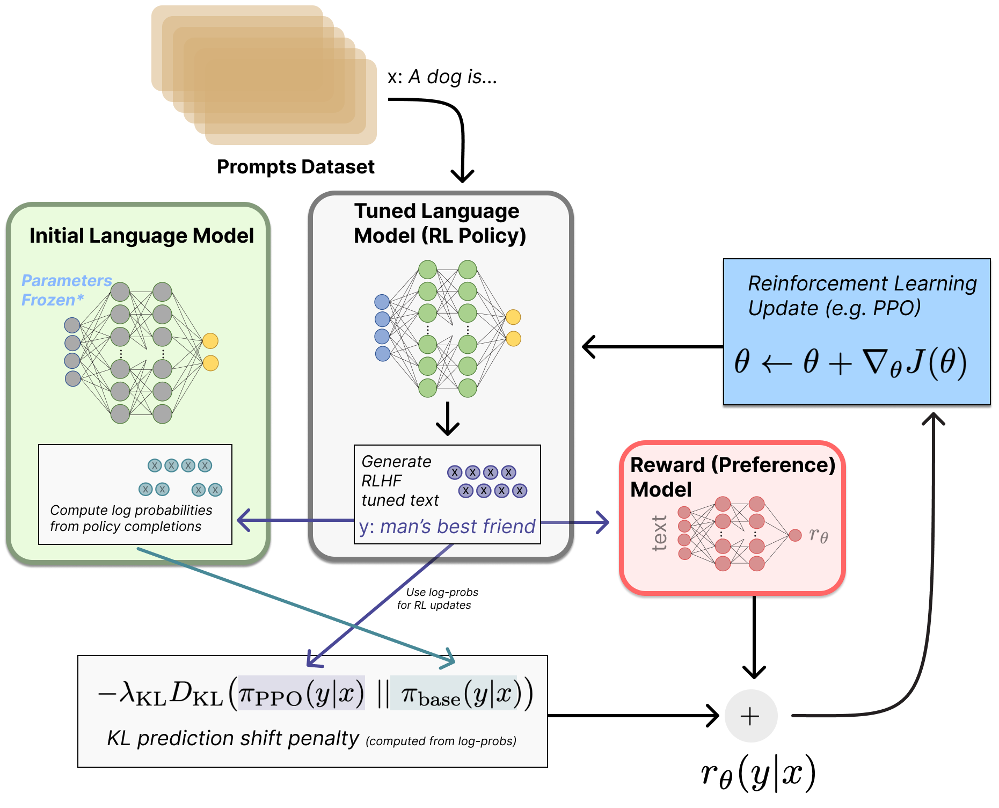

# Reward Model Training



Educational implementations of reward model training for [RLHF Book](https://rlhfbook.com).
See **Chapter 5: Reward Models** for mathematical derivations and intuitions.

> **⚠️ IN DEVELOPMENT**: These implementations are experimental. All three reward models now include config-driven training with validation logging, but datasets and evaluation still need refinement. Contributions welcome!

## Algorithms

| Algorithm | Script | Key Idea |
|-----------|--------|----------|
| **ORM** | `train_orm.py` | Outcome Reward Model - scores full responses |
| **Preference RM** | `train_preference_rm.py` | Bradley-Terry model for pairwise preferences |
| **PRM** | `train_prm.py` | Process Reward Model - scores intermediate steps |

## Reference Runs

| Algorithm | wandb | Status |
|-----------|-------|--------|
| **ORM** | [run](https://wandb.ai/rlhf-book/core/runs/3gkoqb7f) | Experimental |
| **Preference RM** | [run](https://wandb.ai/rlhf-book/core/runs/1g3y9bcc) | Experimental |
| **PRM** | [run](https://wandb.ai/rlhf-book/core/runs/iv4d966d) | Experimental |

## Quick Start

```bash
cd code/
uv sync

# Train ORM
WANDB_PROJECT=rlhf-book uv run python -m reward_models.train_orm \
    --config reward_models/configs/orm.yaml

# Train Preference RM (Bradley-Terry)
WANDB_PROJECT=rlhf-book uv run python -m reward_models.train_preference_rm \
    --config reward_models/configs/preference_rm.yaml

# Train PRM
WANDB_PROJECT=rlhf-book uv run python -m reward_models.train_prm \
    --config reward_models/configs/prm.yaml
```

## Reward Model Configuration

The ORM, PRM, and Preference RM scripts use `reward_models/configs/orm.yaml`,
`reward_models/configs/prm.yaml`, and `reward_models/configs/preference_rm.yaml`,
respectively. For smaller runs, copy the YAML file and edit the copy.

The default config trains Qwen3-0.6B on 5k UltraFeedback preference pairs with:

- effective batch size 16
- learning rate 5e-5
- 2 epochs
- 10% validation split
- linear warmup + linear decay
- validation logging every 25 optimizer steps

These defaults were selected from a small sweep and are intended as a cleaner
educational baseline, not universally optimal hyperparameters.

### Preference RM run artifacts

The checked-in Preference RM config writes one completed run to
`reward_models/runs/preference-rm-qwen3-0.6b/`. The directory must not already
exist. Set `WANDB_PROJECT` before starting the command to enable W&B; the
script also records the same train and validation metrics locally in
`metrics.jsonl`.

After training, `final_model/` contains the fine-tuned backbone, tokenizer,
linear reward head, and loading metadata. Copy the whole `final_model/`
directory to a checkout of the same Git revision, then load it with:

```python
from reward_models.train_preference_rm import load_preference_reward_model

model, tokenizer = load_preference_reward_model(
    "reward_models/runs/preference-rm-qwen3-0.6b/final_model",
    device="cuda:0",
)
```

`summary.json` stores the final metrics and W&B URL; `run_metadata.json` and
`config.yaml` record the environment and exact configuration used for the run.


Reward models are commonly trained for around one epoch to reduce overfitting. This example uses two epochs because it produced cleaner validation curves in a small local 5k-pair sweep, but users should monitor `val/loss` and `val/accuracy` during the second epoch and reduce `epochs` if validation metrics degrade.

## Known Issues

- Training curves may be noisy - hyperparameters not yet optimized
- Dataset selection and preprocessing may need refinement
- Model architectures are simplified for educational purposes

## TODOs for Community Contributions

- [ ] Evaluate on standard benchmarks (RewardBench)
- [ ] Add data augmentation and curriculum learning
